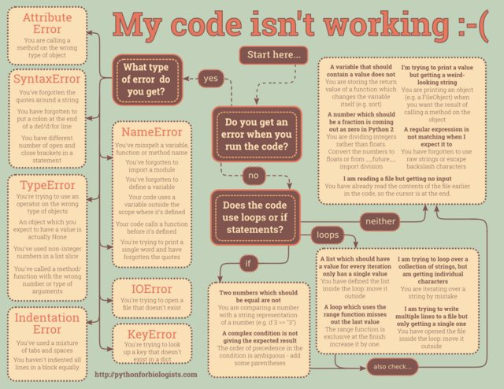

Title: 29 common beginner Python errors
Date: 2010-12-03 10:20
Modified: 2010-12-05 19:30
Category: article
Tags: programming
Slug: 29-common-beginner-errors-on-one-page
Authors: Martin

# 29 common beginner Python errors on one page

A few times a year, I have the job of teaching a bunch of people who have never written code before how to program from scratch. The nature of programming being what it is, the same error crop up every time in a very predictable pattern. I usually encourage my students to go through a step-by-step troubleshooting process when trying to fix misbehaving code, in which we go through these common errors one by one and see if they could be causing the problem.  Today, I decided to finally write this troubleshooting process down and turn it into a flowchart in non-threatening colours.

Behold, the "my code isn't working" step-by-step troubleshooting guide! Follow the arrows to find the likely cause of your problem – if the first thing you reach doesn't work, then back up and try again.

Click the image for full-size, and [click here for a printable PDF](https://www.dropbox.com/s/cqsxfws52gulkyx/drawing.pdf). Colour scheme from [Luna Rosa](http://www.colourlovers.com/palette/2957822/California_Honey*).

**Update: hi, Reddit!  
**

**Update 2: a couple of viewers have correctly pointed out that one of the examples – using a single equals sign in an if statement – actually generates a SyntaxError in Python. Oops! That example was left over in my brain from my days of teaching Perl! I've updated the flowchart and replaced that example with another common error which is dear to my heart – comparing an int with a string representation of an int (for example, read from an input file).**

[Also available in a Russian translation.](http://habrahabr.ru/company/alconost/blog/263403/)

[Also available in Brazilian Portuguese.](http://www.dinomagri.com/meu-codigo-nao-funciona/)

