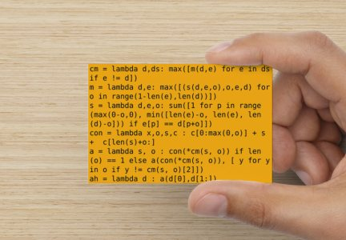

Title: A six line genome assembler
Date: 2010-12-03 10:20
Modified: 2010-12-05 19:30
Category: article
Tags: python, fun
Authors: Martin

# The world’s worst genome assembler in six lines of Python

So, after I posted my new business cards the other day I got a comment to the effect that I should have made one with an aligner. That got me thinking about the biggest thing that I could conceivably fit on a business card, if I didn't care about readability. So I decided that I could probably fit an incredibly bad sequence assembly program on one. Just for fun, I wrote the whole thing in a purely functional style – a total of six lambda expressions.

**Warning: the rest of this post contains discussions of horrible code, rampant abuse of Python features, and the complete opposite of all good programming practise. Read on with caution!**

The API is quite straightforward: give the `ah()` expression a list of DNA sequences, and it will return a consensus string. Here's an ultra-short example:
    
    
    
    reads = ['TCCCAGTGAACCCA', 'TTCCGTGCGGTTAAG', 'GTCCCAGTGAACCCACAA', 'TGAACCCACAAAACG', 'ACCCACAAAACGTGA', 'GAACCCACAAAACGTGA', 'TCCGTGCGGTTAAGC', 'TGAACCCACAAA', 'CCGTGCGGTTAAGCGTGA', 'TGACAGTCCCAGTGAA', 'AACCCACAAAACGTGA', 'AGTGAACCCACAAAACGT', 'GTTAAGCGTGA', 'CCGTGCGGTTAAGCGTGA', 'AGCGTGACAGT', 'TGCGGTTAAGCG', 'ACAAAACGTGATG', 'ACAGTCCCAGTGAACC', 'TAAGCGTGACAGTCCCA', 'TCGAATTCCGT', 'TTCTCGAATTCCGTGCG', 'ACAAAACGTG', 'CCACAAAACGTG', 'TGCGGTTAAG', 'GAACCCACAAAACGTGA', 'TCTCGAATTCC', 'ATTCCGTGCGGTTAA', 'ACCCACAAAAC', 'CGTGCGGTTAAGCGTGA', 'CCAGTGAACCCACAA', 'TGCGGTTAAGCGTG', 'CCCACAAAACG', 'TCTCGAATTC', 'AATTCCGTGCGGTT', 'ACAGTCCCAGTGA', 'GTCCCAGTGAACCCA', 'TGAACCCACAAA', 'CCCACAAAACGTG', 'TCCCAGTGAACCCACA', 'CTCGAATTCCGTGCG']
    print(ah(reads))
    # TGCGGACAAAACGTGTGAACGTGAGGTTAAGCGTGACAGTCCCAGTGAACCCACAAAACGT
    

And here's a local alignment to the sequence from which the fake reads were generated, just to prove that it's actually doing something slightly better than picking the longest read:
    
    
    
     6 GAATTCCGTGCGGTTAAGCGTGACAGTCCCAGTGAACCCACAAAACGT     53
       |||   ||||.|||||||||||||||||||||||||||||||||||||
    17 GAA---CGTGAGGTTAAGCGTGACAGTCCCAGTGAACCCACAAAACGT     61
    

The longest read is 20 bases, and the local match region is 48 bases.

## How it works

Let's start by putting each expression on its own line:
    
    
    
    cm = lambda d,ds: max([m(d,e) for e in ds if e != d])
    m = lambda d,e: max([(s(d,e,o),o,e,d) for o in range(1-len(e),len(d))])
    s = lambda d,e,o: sum([1 for p in range(max(0-o,0), min([len(e)-o, len(e), len(d)-o])) if e[p] == d[p+o]])
    con = lambda x,o,s,c : c[0:max(0,o)] + s +  c[len(s)+o:]
    a = lambda s, o : con(*cm(s, o)) if len(o) == 1 else a(con(*cm(s, o)), [ y for y in o if y != cm(s, o)[2]])
    ah = lambda d : a(d[0],d[1:])
    

Next we'll convert each expression to an equivalent function to make it slightly easier to read:
    
    
    
    def cm(d,ds):
        return max([m(d,e) for e in ds if e != d])
    
    def m(d,e):
        return max([(s(d,e,o),o,e,d) for o in range(1-len(e),len(d))])
    
    def s(d,e,o):
        return sum([1 for p in range(max(0-o,0), min([len(e)-o, len(e), len(d)-o])) if e[p] == d[p+o]])
    
    def con(x,o,s,c):
        return c[0:max(0,o)] + s +  c[len(s)+o:]
    
    def a(s, o):
        return con(*cm(s, o)) if len(o) == 1 else a(con(*cm(s, o)), [ y for y in o if y != cm(s, o)[2]])
    
    def ah(d):
        return a(d[0],d[1:])
    

And change the names to be slightly more descriptive (this makes some lines extremely long, so you'll have to scroll right to read them), and rearrange them slightly:
    
    
    
    # given two sequences and an offset, count the number of matching bases
    def score(sequence1,sequence2,offset):
        return sum([1 for position in range(max(0-offset,0), min([len(sequence2)-offset, len(sequence2), len(sequence1)-offset])) if sequence2[position] == sequence1[position+offset]])
    
    # given two sequences, find the offset which gives the best score
    def find_best_offset(sequence1,sequence2):
        return max([(score(sequence1,sequence2,offset),offset,sequence2,sequence1) for offset in range(1-len(sequence2),len(sequence1))])
    
    # given a single sequence and a collection of others, find the other sequence with the best match score
    def find_best_match(sequence,others):
        return max([find_best_offset(sequence,sequence2) for sequence2 in others if sequence2 != sequence])
    
    # given two sequences and an offset, calculate the consensus
    def consensus(score,offset,sequence1,sequence2):
        return sequence2[0:max(0,offset)] + sequence1 +  sequence2[len(sequence1)+offset:]
    
    # given a sequence and collection of others, return the complete consensus using recursion
    def assemble(sequence, others):
        return consensus(*find_best_match(sequence, others)) if len(others) == 1 else assemble(consensus(*find_best_match(sequence, others)), [ y for y in others if y != find_best_match(sequence, others)[2]])
    
    # given a collection of sequences, call assemble() to start the recursion
    def assemble_helper(dnas):
        return assemble(dnas[0],dnas[1:])
    

Now we can look at each function in more detail.

`score()` is the basic scoring function. It takes two sequences and an offset, and returns the number of characters that match. It's the simplest possible function for scoring an ungapped alignment between two sequences. It works by calculating the first and last positions of the overlapping region relative to `sequence2`, then counts up the number of positions for which the base in `sequence2` is the same as the base in `sequence1` at that position plus the offset. To get everything in one expression, it uses a list comprehension to build a list of 1's for each matching position, then sums the list. Here it is written out a bit more conventionally. The only complicated thing going on here is the calculation of the start and stop positions.
    
    
    
    def score(sequence1,sequence2,offset):
        start_of_overlap = max(0-offset,0)
        end_of_overlap = min([len(sequence2)-offset, len(sequence2), len(sequence1)-offset])
        total_score = 0
        for position in range(start_of_overlap, end_of_overlap):
            if sequence2[position] == sequence1[position+offset]:
                total_score = total_score + 1
        return total_score
    

`find_best_offset()` is the function that tries to maximize the score for a pair of sequences by trying every possible offset. It works by first calculating the range of possible offsets, then using a list comprehension to build a list of tuples, one tuple for each possible offset. Each tuple contains the score, the offset, and the two sequences – this slightly weird way of storing the results is necessary so that the information can be passed to the other functions, as we'll see in a minute. To find the single best offset, we take advantage of the fact that in Python, sorting a list of tuples sorts them by their first element. Since the first element of each of our tuples is the score, if we simply ask for the `max()` of the list we get the tuple with the highest first element i.e. the one representing the best score. Here's the sensible version:
    
    
    
    def find_best_offset(sequence1,sequence2):
        lowest_offset = 1-len(sequence2)
        highest_offset = len(sequence1)
        all_offsets = []
        for offset in range(lowest_offset,highest_offset):
            # add the 4-tuple for this offset
            all_offsets.append((score(sequence1,sequence2,offset),offset,sequence2,sequence1))
        return max(all_offsets)
    

`find_best_match()` is probably the most straightforward function of the bunch. Given a single sequence and a list of other sequences, it finds the other sequence that has the best match by calling `find_best_offset()` for each of them in turn. It uses the same tuple-sorting trick as before to figure out which match is the best:
    
    
    
    def find_best_match(sequence,others):
        all_matches = []
        for sequence2 in others:
            if sequence2 != sequence:
                all_matches.append(find_best_offset(sequence,sequence2))
        return max(all_matches)
    

The `consensus()` function gave me quite a bit of trouble. Its job is to take two sequences plus a given offset, and return the consensus sequence of the two. Of course, it doesn't do anything like what we normally mean by consensus – it simply concatenates the relevant bits of the two sequences to make a longer one. The logic behind how it works is a little bit hard to follow. We construct the consensus sequence by taking the full length of `sequence1`, and sticking any left-hand overhang from `sequence2` on the left end and any right-hand overhang from `sequence2` on the right end. In other words, you should read the return line as "return any bits of `sequence2` that stick out to the left, followed by the whole of `sequence1`, followed by any bits of `sequence2` that stick out to the right". For most overlapping pairs of sequences, either the first or last bit of the returned string will be zero-length, which is why the thing works as a single expression in the compact version.
    
    
    
    def consensus(score,offset,sequence1,sequence2):
        sequence2_left_overhang = sequence2[0:max(0,offset)]
        sequence2_right_overhang = sequence2[len(sequence1)+offset:]
        return sequence2_left_overhang + sequence1 + sequence2_right_overhang
    

The `assemble()` function is probably the most complicated (and certainly the most inefficient). I cheated a little bit to get it onto a single line by using the ternary operator `x if y else z`. It's a recursive function that takes a single sequence and a collection of other sequences. It finds the best match for the sequence among the others and calculates the consensus of the sequence and the best-matching other. If that's the only member of `others` (i.e. the others list has just one element) it simply returns the consensus. If the `others` list has more than one element, it removes the best matching one and calls itself recursively with the newly built consensus as the single sequence. Here it is expanded:
    
    
    
    def assemble(sequence, others):
        # remember, best_matching_other is a 4-tuple
        best_matching_other = find_best_match(sequence, others)
        # the * expands the elements of the tuple so we can use them as arguments to consensus()
        consensus_sequence = consensus(*best_matching_other)
        if len(others) == 1:
            return consensus_sequence
        else:
            # get the second element of the best_matching_other tuple, which is the sequence
            best_matching_sequence = best_matching_other[2]
            others.remove(best_matching_sequence)
            return assemble(consensus_sequence, others)
    

`assemble_helper()` is, as the name suggests, just a helper function which kicks off the recursion by calling `assemble()` with the first element as the single sequence and the remainder of the elements as the list of other sequences.

Let's sum up the algorithm then (described iteratively, even though it's written recursively). To assemble a list of N DNA sequences, we take the first sequence, and find the member of the remaining N-1 sequences which has the best match. We remove this best-matching member from the list (leaving N-2 sequences) and calculate the consensus of these two sequences. We then append the newly-built consensus onto the end of the list (bringing the sequence count back up to N-1), then go back to the start and begin again. Hopefully it's clear that, since the number of sequences in the list decreases by one in each iteration, we will eventually end up with a list of just a single sequence, which is our result.

A discussion of the performance of this algorithm is both beyond the scope of this post, and entirely unnecessary. Suffice it to say that it has horrible performance in terms of both computation time and results! At around 430 characters I think that the compact version is pushing the limits of what can fit on a business card in 12 point text. 

  
