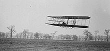
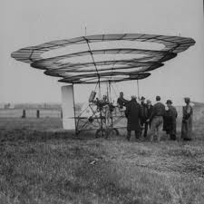

Title: What you have in common with the Wright brothers
Date: 2010-12-03 10:20
Modified: 2010-12-05 19:30
Category: article
Tags: programming
Authors: Martin

# What you have in common with the Wright brothers

Warning: vast historical oversimplification below in pursuit of a point :-)

Famously, the Wright brothers built and flew the first aircraft capable of sustained, powered flight in 1903. Looking at the famous photos with eyes used to seeing modern aircraft, it looks pretty airworthy:

There were plenty of other people working on heavier-than-air flying machines around that time, many with much more money and far more resources. So what was the key to the Wright brothers' success? Did they invent a new type of engine? A new type of wing? Not really – their greatest invention was this:

This unprepossessing-looking box is a wind tunnel, which the Wright brothers – realizing that it was far too time-consuming to test wing designs by building them full scale – used to test their aeronautical designs using models. The innovation that prompted their break-through was not an improvement to **aircraft**, but an improvement in the** process for designing aircraft**. By using a wind tunnel, they were simply able to make their mistakes faster than anyone else, and to learn from them. Others had to learn by building, and crashing, full-size aircraft.

This is far from an original observation, but I think it has some connection with programming. The story of the Wright brothers illustrates the power of rapid iterative improvement – their approach would probably be called "agile" if it were being used today. The difference between the Wright brothers and their contemporary rivals mirrors one that I often see between the different approaches to writing code I see being used by my students.

On the one hand, you have people who favour small, incremental improvements when writing a program or a function, testing each bit of code as soon as possible and uncovering bugs and mistakes early. Students who program in this way end up with programs and functions that resemble the Wright Flyer pictured above: crude and primitive, perhaps, but certainly fit-for-purpose and relatively unlikely to result in broken bones.

On the other hand, you have people who try to write an entire program or function all in one go, never testing any bit of it until the whole thing is written. Students who program in this way end up with programs and function that resemble other products of early aviation:

As the picture above attests, this is a recipe for pain.
